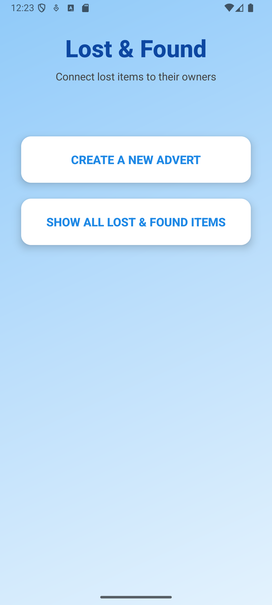
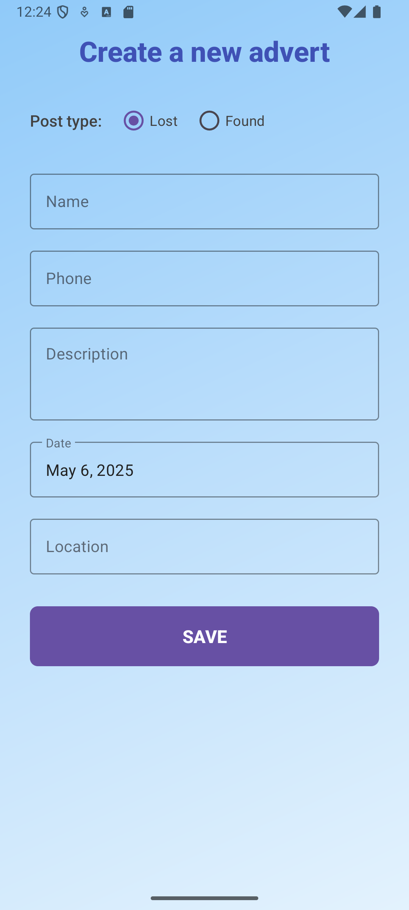
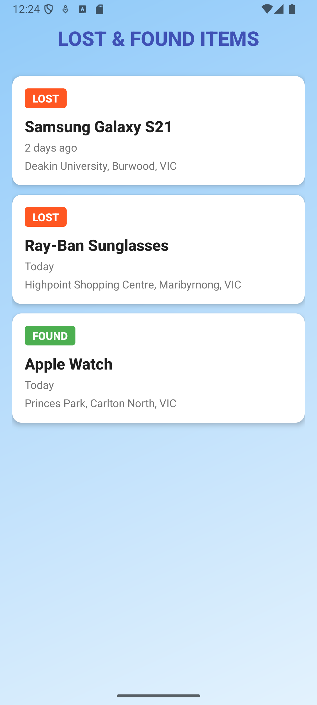
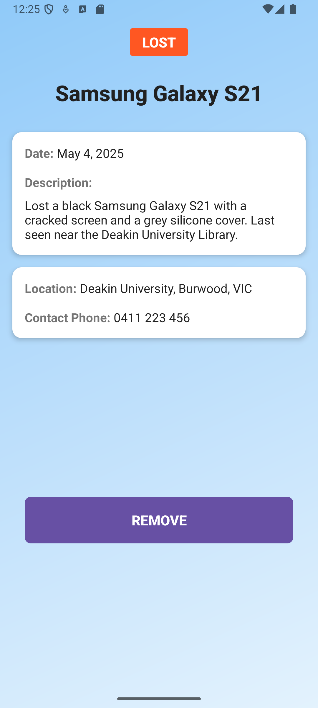

# Lost & Found App

A mobile application to help people report and recover lost items by connecting with others in their community.

## Features

- **Report Lost/Found Items**: Create listings with details like name, description, location, and contact information
- **Browse Listings**: View all lost and found items in a scrollable list
- **Detailed Item Views**: See complete information about each item.
- **Contact Owners**: Directly call or message the person who posted the listing
- **Simple Interface**: User-friendly design for quick posting and searching

## Screens

1. **Home Screen**
   - Main landing page with options to create new listings or browse existing ones

2. **Create Advert Screen**
   - Form to report lost or found items with:
     - Item type (Lost/Found)
     - Name and description
     - Date and location
     - Contact information

3. **Items List Screen**
   - Displays all active listings categorized as Lost or Found
   - Shows key information: item name, time since posting, and location

4. **Item Details Screen**
   - Complete information about a specific item
   - Includes description, exact location, contact details
   - Option to remove listing when item is recovered

## Technical Details

- **Platform**: Android
- **Database**: SQLite with Room persistence library
- **UI**: Material Design components with ConstraintLayout

## Future Enhancements

- User authentication system
- Push notifications for matches
- Image upload support
- Map view of nearby listings
- Social media sharing

## Installation

1. Clone this repository
2. Open in Android Studio
3. Build and run on an emulator or physical device
